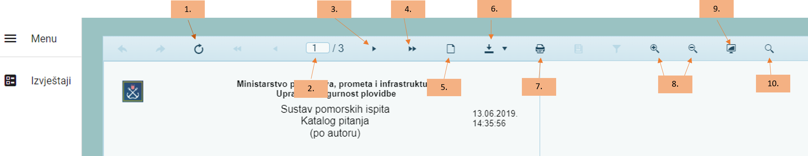

Navigacija
====================

Glavni izbornik (Menu) nalazi se s lijeve strane i sadrži ikonu *Izvještaji*. 

Osnove navigacije
^^^^^^^^^^^^^^^^^^^^^^

- Kada se prijavite u *Performa 365 Izvještaji* otvorit će se glavni prozor s popisom izvještaja. 
- Izvještaji su različiti za različite uloge u sustavu (administrator pitanja, administrator ispita, administrator rokova)
- Upitnik na pojedinom izvještaju znači da određeni izvještaj ima stranicu pomoći za taj izvještaj

Kada otvorimo određeni izvještaj, on na vrhu ima svoju navigaciju kako slijedi:

1. Osvježite stranicu
2. Prikaz stranice na kojoj ste trenutno; upisom broja stranice u prvo polje, prebacuje se na traženu stranicu
3. Iduća stranica
4. Posljednja stranica
5. Pregled prije ispisa
6. Preuzimanje podataka; odabir dokumenta za preuzimanje
7. Ispis izvještaja
8. Uvećaj/smanji
9. Uključivanje cijele stranice
10. Pretraživanje

