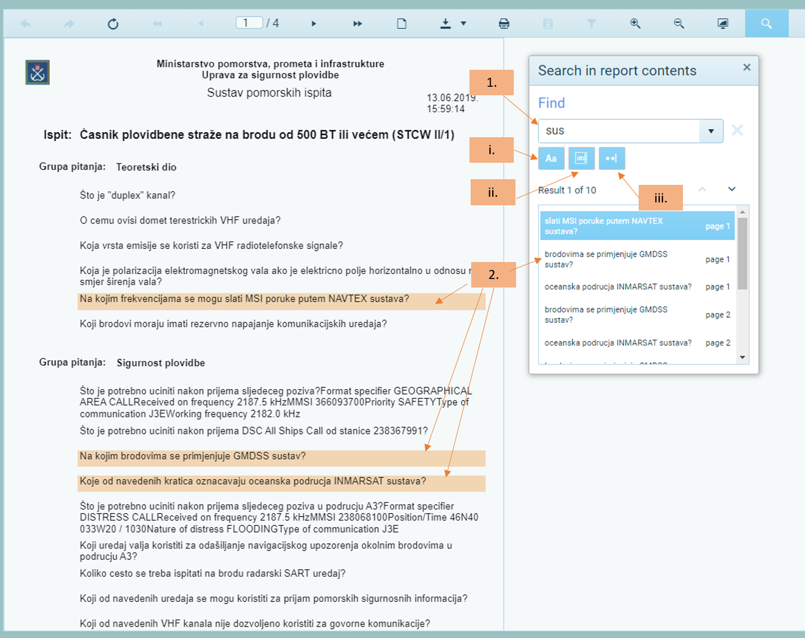

Pretraživanje
======================

1.  Upišite riječ za pretragu
2. Izlistat će se sve rečenice (s lijeve strane) u sustavu koje sadrže upisanu riječ u pretraživač, kao i u prozoru pretraživača gdje dodatno prikazuje na kojoj se točno stranici riječ nalazi te kratkim pregledom možemo „skočiti“ na određenu rečenicu na određenoj stranici

3. Sortiranje u pretraživanju:

- a.	Velika/mala slova (prepoznaje i uključuje samo odabranu veličinu slova)
- b.	Prikaz samo točno upisane riječi
- c.	Uključuje dodatne znakove za pretraživanje

